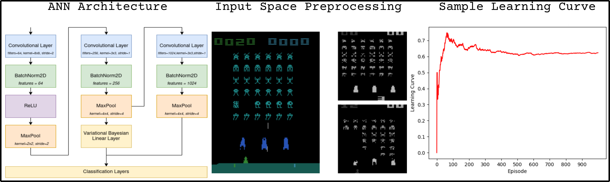

# Bayesian Reinforcement Learning
[](https://github.com/frederikgram/Bayesian-Reinforcement/blob/master/LICENSE)


Reinforcement Learning with Variational Bayesian Inference and Elastic Weight Consolidation (EWC).

In this project we present an implementation of a deep reinforcement learning agent, specifically using a Deep Deterministic Policy Gradient (DDPG) algorithm. 

The underlying Artificial Neural Network (ANN) has an architecture similar to that of typical RESNETs, though with a few differences, as architectures such as _RESnet50_ are simply too large for this project.

The agent is trained using a Variational Bayesian Network, which in broad terms means that their weights are represented by a probability distribution, rather than a single value. This allows the agent to learn from sparse rewards, as well as to learn from multiple tasks.

Further, the agent is trained using Elastic Weight Consolidation (EWC), which is a method of preventing catastrophic forgetting. Intuitively, this can be thought of as a way making neurons more resilient to changes in the environment, in proportion to their importance. Neurons which are important to the current task are less likely to be changed, and thus are less likely to forget the current task.

Ultimately, this agent is exemplified by playing Atari games, such as _Space Invaders_ and _Breakout_. However, the agent is not limited to these games, and can be used for any discrete action space environment.

:pushpin: [Paper](https://raw.githubusercontent.com/frederikgram/Bayesian-Reinforcement/master/report.pdf?raw=true)

:pushpin: Canvas Summary



## Installation

### Install Python dependencies
`pip3 install -r requirements.txt`

### Install the Atari ROMs
Install the ROMs for the Atari games, a guide can be seen here:

`https://github.com/openai/atari-py`

## Training
The following is an example command which should be able to be run out of the box.

`python3 train.py --render --verbose --epsilon_decay 0.99911 --environment space_invaders --n_step 4 --lr_model 0.001 --frames 4 --frame_skip 4 --batch_size 32 --gamma 0.99 --epsilon_min 0.01 --save --max_episodes 1000 --params_update 4 --memory_capacity 5000 --backup`

If your device supports CUDA, you can use the GPU to train the model. To do so, add the `--use_cuda` flag to the command above.

More information about the flags can be found by running `python3 train.py --help`.

Once the training is completed, or has been stopped via. `Ctrl+C`, the model will be saved inside a new directory, where the metrics will be saved as a `.npy` file.

### Settings
```
usage: train.py [-h] [--environment {breakout,space_invaders,tennis}]
                [--max_episodes MAX_EPISODES] [--max_steps MAX_STEPS]
                [--memory_capacity MEMORY_CAPACITY] [--batch_size BATCH_SIZE]
                [--epsilon EPSILON] [--epsilon_decay EPSILON_DECAY]
                [--epsilon_min EPSILON_MIN] [--lr_model LR_MODEL]
                [--seed SEED] [--kl_weight KL_WEIGHT] [--gamma GAMMA] [--save]
                [--plot] [--verbose] [--use_cuda] [--frame_skip FRAME_SKIP]
                [--test_model TEST_MODEL] [--backup] [--n_step N_STEP]
                [--frames FRAMES] [--params_update PARAMS_UPDATE] [--imwrite]
                [--render | --slow_render]

optional arguments:
  -h, --help            show this help message and exit
  --environment {breakout,space_invaders,tennis}
  --max_episodes MAX_EPISODES
  --max_steps MAX_STEPS
  --memory_capacity MEMORY_CAPACITY
  --batch_size BATCH_SIZE
  --epsilon EPSILON
  --epsilon_decay EPSILON_DECAY
  --epsilon_min EPSILON_MIN
  --lr_model LR_MODEL
  --seed SEED
  --kl_weight KL_WEIGHT
  --gamma GAMMA
  --save
  --plot
  --verbose
  --use_cuda
  --frame_skip FRAME_SKIP
  --test_model TEST_MODEL
  --backup
  --n_step N_STEP
  --frames FRAMES
  --params_update PARAMS_UPDATE
  --imwrite
  --render
  --slow_render
```


### Common Errors

`RuntimeError: cuDNN error: CUDNN_STATUS_MAPPING_ERROR`
> This is caused by the frequency of parameters being updated. To fix this, decrement the `--params_update` flags value in the above command.

`RuntimeError: CUDA out of memory`
> Same as above.

`Rendering doesn't work, env.render() complains.`
> This is caused by the `--render` flag. To fix this, remove the `--render` flag from the above command if it is there.

`ValueError: crop_width has an invalid length: 3`
> This happens if you've installed the ROMs via. ale (`A.L.E. (Arcade Learning Environment)`) instead of `atari-py`. To fix this, uninstall `ale-py` and install `atari-py` instead. (See https://github.com/openai/atari-py)